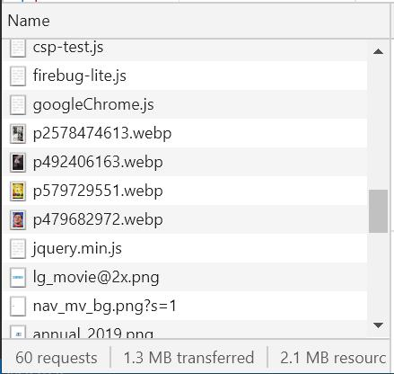
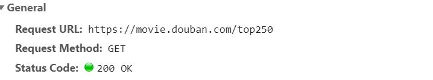
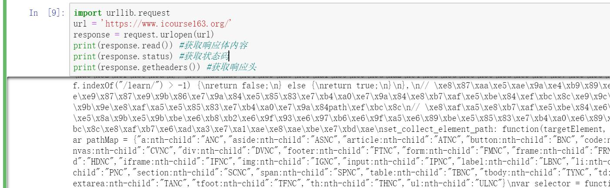
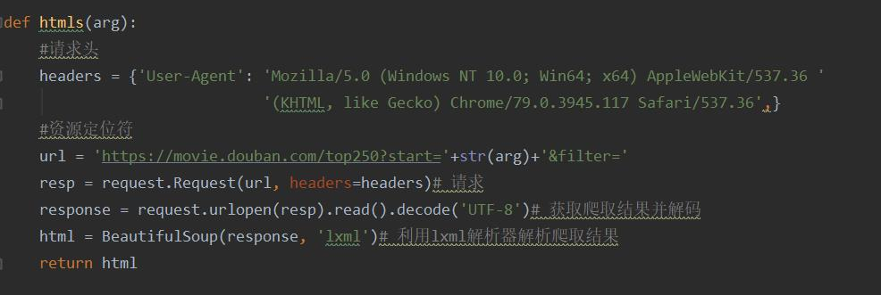
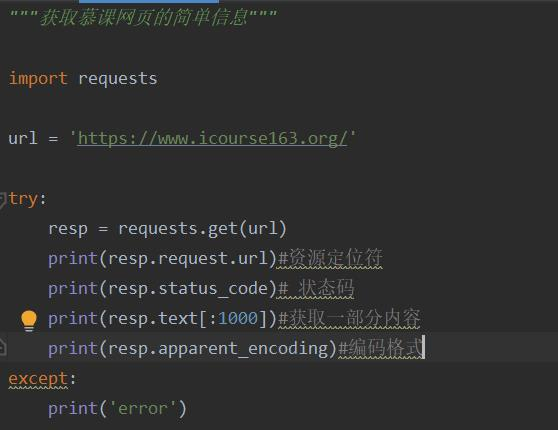

# 爬虫
* 网络爬虫是一种能根据设定的需求自动爬取所需要的网络信息的程序。当我们使用浏览器打开网页时，我们向浏览器输入网站地址，浏览器通过输入的网站找到所在的服务器，并向服务器发送请求，服务器结果解析后向浏览器发送请求结果，其中就包括html，css，js等文件内容，当然还呈现在网页上面的一些图片。
  
  
  就例如这里面所呈现出来的。而我们的浏览器通过解析这些内容最后将其呈现给我们。而爬虫就是通过获取分析这些代码来获得我们想要的信息（像一些网页内容，照片，视频等）。爬虫本身的过程也是模拟浏览器向目标网址所在服务器发送请求。一般通过HTTP库向网站发送请求，如果服务器有响应的话，一般会得到的返回内容是html，或是json格式的对象，或是二进制的数据（图片或是视频）。

# 爬虫的基本流程
* 1. **发起请求**
  
  通过http库向目标服务器发起一个请求Request，里面包含有请求头headers等信息，等待服务器响应我们我们的请求，就有点像我们在浏览器输入一个网址，然后等待网址打开。这个过程其实浏览器也是在做着同样的事情。
* 2. **获取响应**
  
  在我们发出请求后，如果没有什么大问题，我们应该能获得响应内容。里面就可能有html，json，css，还有一些二进制文件等。
* 3. **解析响应内容**
  
  既然服务器给我们的内容可能是不一样的，那么我们就要根据不同的格式来解析我们获取的内容，对于html文件，我们可以利用正则表达式进行解析。还可以有一个偷懒的方法，用bs4中的BeautifulSoup模块。json文件可以用.json()来解析。
* 4. **保存数据**。
  
  对于我们采集来的数据，我们可以将数据保存到本地文件，像普通的txt， xls等，也可以保存到数据库，还可以下载保存为特定jpg和mp4文件。
* 5. **什么是request**
  
  浏览器发送请求给网址所在服务器的过程就是HTTP Request
* 6. **request**
  
  请求方式：请求方式主要有两种：get 、post。此外还有head，put，dellete等。  get的请求参数会暴露在请求的url链接上，像百度搜索中https://www.baidu.com/s?wd=请求参数，只不过这个请求参数中的中文被转成其他编码格式。而post请求会将我们的信息以键值对储存在请求中。
* 7. URL
  
  资源定位符，我们通常所说的网址。网页文档，图片，音乐等都可以用唯一的资源定位符来确定。它可以指出文件的位置，和浏览器应该怎么去处理这些文件。
* 8. 请求头
  
  包含请求时头部的信息，例如User-Agent（指定浏览器的请求头），Host，Cookies等信息。
* 9. 请求体
  
  指请求时额外携带的数据，例如登录账号密码等。
* 10. 什么是response
  
  指请求网站根据浏览器发送的请求做出相应的反映处理，将数据发送个给浏览器的过程，叫做HTTP Response
* 11. response中包含多种信息，包括响应头，响应体，响应状态。响应状态中200表示成功，404表示找不到页面，502表示服务器错误。响应体包括请求的资源的内容包括网页html代码，二进制数据，我们最主要的工作就是要把这部分的东西给挖出来。响应头包括内容类型，内容长度，服务信息等。
# urllib库
* urllib库是Python内置的一个http请求库，，具体提供了请求、异常处理、和解析模块。
  
  引入方式也和其他的模块一样。

  ```
  from urllib import request # 请求模块
  from urllib import error # 异常处理模块
  from urllib import parse # 解析模块
  ```

  最简单的请求的格式例如请求百度的一个get请求可以使用下面的代码

  ```
  from urllib import request

  response = request.urlopen('https://www.baidu.com')
  ```

  这里用到了request里面的一个重要的函数urlopen。在这个函数里面实际上是有三个参数的。参数如下：urlopen(url, data, timeout)

  如果我们添加data参数，那么我们可以将这个请求变成post请求。

  ```
  from urllib import parse
  from urllib import request

  data = bytes(parse.urlencode({'try':'first'}), encode = 'utf-8')
  response = request.urlopen('http://httpbin.org/post', data=data)
  print(response)
  ```

  这里要用到bytes(parse.urlencode())可以将post的数据转化放到参数data中。

  **timeout参数**通过这个参数我们可以设置一个时间限制。一旦出现了请求时间过长，或是请求异常的时候，程序就会终止，不会一直在等待结果。

  至于要使用哪种请求就要看你请求的网站是什么请求类型

  

  就例如这个，我们可以通过浏览器看出请求的类型是get类型。

  对于响应，我们可以通过response.read()、response.status、response.getheaders()来获取响应体的内容，状态码，和响应头。

  

  对于利用响应头的请求方式。有些网站利用上面的方式是无法获取信息的，因此我们要用到设置响应头的方式。这里要用到urllib.request.Request

  参数介绍：urllib.request.Request(url, headers, data, method)这里的url是资源定位符也就是链接，headers是请求头， data和上面一样， method是指请求类型。设置好后就可以将这个request对象放到urlopen函数里面。

  这里举一个例子：

  

  **异常处理**在urllib.error里面只有两个异常错误：URLError、HTTPError.在urlerror里面只有一个属性，reason。在发生异常的时候就可以通过reason反映出错误信息。

  ```
  from urllib import error
  from urllib import request

  try:
      response = request.urlopen("https://www.baidu.com")
  except error.URLError as e：
      print(e.reason)
  ```

  而HTTPError里面有三个参数code、headers、reason。

  当然通过urllib，还可以使用各种高级代理等方法。

# 对于requests库
* 这个是一个基础的HTTP库。这个使用起来感觉很简单粗暴，比上面的要简单很多。
  格式

  ```
  import requests

  response = requests.get("http://www.baidu.com")
  ```
  
  当然也可以在里面加参数headers。对于其他的请求也就是把上面的get改一下，例如requests.post()、requests.put()等。里面的参数设置还是不变的。也可以通过一些属性来查看信息

  
  通过response.json()可以解析json。总体使用上比上面的要方便一些。

# 代理
* 代理指的是代理服务器，功能就如字面的意思，代理用户去请求，获取服务器发送回来的信息。通常情况下我们是通过浏览器输入网址，向web服务器发送请求，然后web服务器在把响应发送给我们。假如我们在本机和web服务器之间搭建一个中转站也就是代理服务器，那么向web服务器发送请求的就不是本机，而是由代理服务器发送出去的。接着代理服务器获得响应再发送给我们本机，这样服务器识别到的ip地址就不是我们本机的，因此我们就这样完成了ip的伪装。
* 代理的作用：
  
  1突破自身ip的访问限制，访问一些平时不能访问的网站，方便文明上网

  2访问内部的资源，就简单举学校的例子，有些事情只能登陆校园网才能办理，还可以通过校园网访问，阅读，免费下载知网的论文。

  3隐藏真实的ip，对于爬虫来说隐藏自己的ip为了防止自身账号被封。

  4提高访问速度，通常代理服务器都设置有较大的硬盘缓冲区。当外界有信息通过时，会将信息保存在缓冲区中。当其他用户访问相同的信息时就直接由缓冲区弹出，传给了其他用户，提高了访问速度。

* 代理分类
  
  1按照协议发类，代理可以分为：
  
  FTP代理服务器：一般有上传、下载和缓存功能，端口为21、2121等。

  HTTP代理服务器：主要用于访问网页，一般有内容过滤缓存功能，端口一般为：80、8080、3128

  SSL/TLS代理：主要用于访问加密网站，一般有SSL或TLS加密功能（最高支持128位加密强度），端口一般为443。

  RTSP代理：主要用于访问Real流媒体服务器，一般有缓存功能，端口一般为554。

  Telnet代理：主要用于telnet远程控制（黑客入侵计算机时常用于隐藏身份），端口一般为23。

  POP3/SMTP代理：主要用于POP3/SMTP方式收发邮件，一般有缓存功能，端口一般为110/25。
 
  SOCKS代理：只是单纯传递数据包，不关心具体协议和用法，所以速度快很多，一般有缓存功能，端口一般为1080。SOCKS代理协议又分为SOCKS4和SOCKS5，前者只支持TCP，而后者支持TCP和UDP，还支持各种身份验证机制、服务器端域名解析等。简单来说，SOCK4能做到的SOCKS5都可以做到，但SOCKS5能做到的SOCK4不一定能做到。

  2按照匿名程度分类：

  高度匿名代理：会将数据原封不动地发送给用户， 在服务端方面会认为是一个真的客户端在访问一样。

  普通匿名代理：会在数据包上做处理，服务端可能会发现这是个代理服务器。有一定几率查到用户的真实ip

  此外还有透明代理和间谍代理

* **常见的代理设置**
  有网上的免费代理

  付费代理  网上也有很多这种服务

  ADSL拨号：拨一次号，换一次ip，较为有效稳定。

# 正则表达式
* 正则表达式是有一串特殊字符串组成的，通过这些特殊字符串所组成的特殊的规律去匹配符合这些规律的字符串。
* 正则字符：
  
  '^': 匹配字符串的开始的位置

  '$': 匹配字符串的结尾的位置

  '\b': 检测单词的开始或结束位置

  '\d': 匹配数字

  '\w': 匹配字母，数字，下划线

  '\s': 匹配空格

  "[xxx]": 字符串组，匹配括号里面的字符串

  '.': 代表所有单个字符

  '\W', '\S', '\D'大写的跟小写的唱反调，例如'\D'匹配的就是那些除了数字的

  "[^xxx]": 与[xxx]唱反调，匹配的是不是括号里面的字符串

  **量词**：

  '*': 贪婪匹配， 匹配零次或是更多次

  '+': 一次或者更多次

  '?':重复零次或一次

  '{n}': 重复n次

  '{n, m]': 重复n到m次

  '{n, }': 重复n次到无数次

  **惰性限定符**：

  '*?':  重复任意次，但尽可能少重复

  '+?': 重复1次或更多次，但尽可能少重复

  '??':重复0次或1次，但尽可能少重复

  '{n, m}?':重复n到m次，但尽可能少重复

  '{n, }?':重复n次以上，但尽可能少重复

  **捕获分组**：
  
  实际是将括号()里面的字符归为一组然后去查找，例如

  ```
  import re
  pattern1=re.compile(r"(ab)+")
  result1=pattern1.findall("abcabcacbd")
  print(result1)

  """
  结果为：['ab', 'ab']
  """
  ```

  此外还可以利用(?P<name>)这样的格式给捕获的字符分组命名

* 结合Python理解正则表达式
  在Python里面字符串里有些字符跟正则表达式有点冲突，例如\b在字符串里面表示的是退格，而在正则表达式里面表示的是检测单词的开始或结束位置，因此如果我们在Python中如果不使用原生字符串的话那么匹配的结果就跟我们理想中的不太一样。

  ```
  import re
  pattern1=re.compile(r"\bworld\b")
  result1=pattern1.search("hello world ")
  print(result1)
  
  结果为：<re.Match object; span=(6, 11), match='world'>
  ```

  假如我不使用表示原生字符串的'r'，那么结果为

  ```
  import re
  pattern1=re.compile("\bworld\b")
  result1=pattern1.search("hello world ")
  print(result1)

  结果：none
  ```

  后面的绝大部分例子都会用到这个原生字符串的。

* **两种匹配格式**
  正如上面看到的，在Python里面re模块可以将我们编写的正则表达式编译成模块对象，然后进行匹配。

  当然Python里面还可以使用模块函数直接进行匹配，例如上面的例子就可以该改写成：

  ```
  result1 = re.search(r"\bworld\b", "hello world ")
  ```

  这种格式来匹配。

* 控制标志符
    re.I：忽略正则表达式中的大小写，比如：[A-Z]也能够匹配小写的a-z
    re.M：正则表达式中^操作符能够将字符串每行当作匹配开始
    re.S：正则表达式中.操作符能够匹配所有字符，默认情况下.不能匹配换行

* **关于re.match**
  我们可以向这个方法传入主要的两个参数，一个是我们编写好的正则表达式，一个是我们要匹配的字符串。注意这个函数是从头开始匹配的，如果开始的内容不符合的话会直接返回none，如果匹配成功的话，会返回一个object里面包括匹配内容的开始和结束的位置，和匹配的内容。

  ```
  import re
  pattern1=re.compile(r"1.*")
  result1=pattern1.match("232143545 ")
  print(result1)
  ```

  像上面这种情况返回的结果就是none。因为开始的第一个字符已经不符合了。我们可以换成search函数，或者匹配一下开头来解决。

  ```
  import re
  pattern1=re.compile(r"1.*")
  result1=pattern1.match("132243545 ")
  print(result1)

  #结果为:<re.Match object; span=(0, 10), match='132243545 '>
  ```

  这里也用了贪婪匹配，有与.表示所有的字符（除了\n\r）,因此这里1先与字符串开头的1匹配后， '.*'会把后面的所有字符匹配，那么这里我们给它加上？结果又会有变化：

  ```
  pattern1=re.compile(r"1.*?")
  ```

  改成上面这种的话结果为"1",因为.*会匹配零次或者更多次，而？会使得匹配尽量少重复。因此这里只有出现开头的字符。

* **提取某段内容**
  先看一段字符串"I have 100 money",如果要讲里面的100给提取出来，刚开始想到的可能是利用分组，使用r"I.*(\d+)\D*y"这一段正则表达式，但这样子匹配出来的结果只有0这个数字。

  代码如下：

  ```
  import re
  pattern1=re.compile(r"I.*(\d+)\D*y")
  result1=pattern1.match("I have 100 money")
  print(result1.group(1))
  ```
  
  原因在于：.*会尽可能的匹配，所以会一直匹配到第一个0处，因为\d+会匹配一个或者更多的数字，所以只剩一个0给它匹配也就符合。这时候如果在*后面加上？，那么匹配的结果就是100这个完整的数字。因为？会使得.* 尽可能减少重复，当匹配完一个字符后，有因为\d不符合，所以回退.*还得接着匹配，这样子直到匹配到100前面的空格。

  对于上面例子中用到的括号，这也就是一个分组，当然如果需要的话，我们还可以设置更多的分组。然后用.group(n)引索出组的内容，n表示的是第几个组别，group() 同group（0）就是匹配正则表达式整体结果.同时我们还可以给这些组别命名，利用(?P<name>exp)这个格式。

  ```
  import re
  pattern1=re.compile(r"I.*?(\d+)\D*?(?P<name>\d+)")
  result1=pattern1.match("I have 100 money.My brother has 200 money .")
  print(result1.group(1), result1.group('name'))

  """
  结果：100 200
  """
  ```

  此外还有非捕获的形式，格式为(?:exp)匹配exe但不捕获文本。

* **关于re.search**
  上面有一个错误例子改变的方法是换成search函数，因为search函数是在整个字符串中搜索，假如开始的位置不符合，它会继续往下进行，直到搜索完整个字符串。返回类型和match一样。

  ```
  import re
  pattern1=re.compile(r"1.*")
  result1=pattern1.search("232143145 ")
  print(result1)
  ```

  这个是上面的例子改成用search函数进行，这样子匹配出来的结果是<re.Match object; span=(3, 10), match='143145 '>。

* **re.findall**
  上面的两个函数都是返回一个结果。而利用findall可以获取所有的结果并将结果储存在列表中返回。

  ```
  import re
  pattern1=re.compile(r"(ad)+")
  result1=pattern1.findall("23ad14acb14ad5 ")
  print(result1)
  ```

  这样子打印出来的结果为：['ad', 'ad']，若是使用search的话只会返回来一个ad。